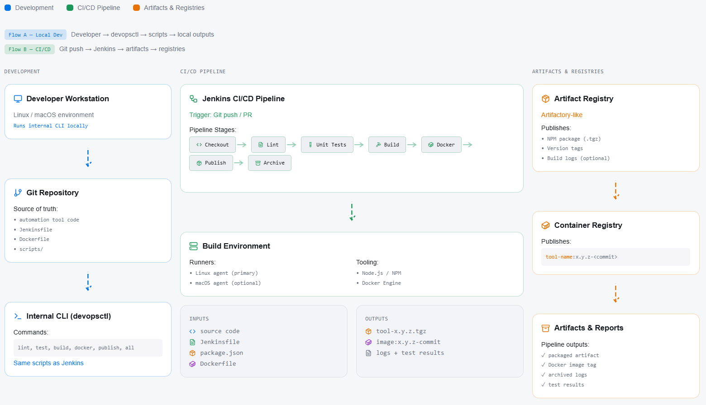

# DevOps Toolchain Pipeline

A fully automated CI/CD pipeline demonstrating end-to-end DevOps ownership, multi-environment support, and internal tooling development across Linux, macOS, and containerized environments.

---

## 🏗️ Architecture



**Flow A - Local Development:**
`Developer → devopsctl → scripts → local outputs`

**Flow B - CI/CD Pipeline:**
`Git push → Jenkins → artifacts → registries`

| Component | Description |
|-----------|-------------|
| **Developer Workstation** | Linux/macOS environment running internal CLI locally |
| **Git Repository** | Source of truth: automation code, Jenkinsfile, Dockerfile, scripts |
| **Internal CLI (devopsctl)** | Commands: lint, test, build, docker, publish, all |
| **Jenkins CI/CD Pipeline** | Stages: Checkout → Lint → Unit Tests → Build → Docker → Publish → Archive |
| **Build Environment** | Runners: Linux/macOS agents, Tooling: Node.js/NPM, Docker Engine |
| **Artifact Registry** | Publishes: NPM package (.tgz), version tags, build logs |
| **Container Registry** | Publishes: `tool-name:x.y.z-<commit>` |
| **Artifacts & Reports** | Outputs: packaged artifact, Docker image tag, archived logs, test results |

---

## 🎯 Skills Demonstrated

| Skill Area | Implementation |
|------------|----------------|
| **Multi-Environment Support** | Linux, macOS, Windows (WSL), Docker containers |
| **CI/CD Pipeline** | Jenkins Pipeline as Code (Jenkinsfile) |
| **Version Control** | Git-based workflow with push triggers |
| **Build Tools** | NPM, npm pack, semantic versioning |
| **Artifact Management** | Structured artifact repository with versioned storage |
| **Programming** | Python (CLI tool), JavaScript/Node.js (service) |
| **Containerization** | Docker multi-stage builds, image tagging |
| **Automation** | Shell scripting (Bash), automated testing |
| **Testing** | Jest unit tests, JUnit reporting, ESLint |

---

## 🚀 One-Command Demo

```bash
python cli/devopsctl.py all
```

This single command runs the complete CI/CD pipeline locally:
- ✅ **Lint** - ESLint code quality checks
- ✅ **Test** - Jest unit tests (24 tests) with JUnit reporting
- ✅ **Build** - NPM package creation with version tagging
- ✅ **Docker** - Container image build with commit hash tags
- ✅ **Publish** - Artifact archival with manifest generation

---

## 🖥️ Multi-Environment Support

### Platforms Tested

| Environment | Status | Notes |
|-------------|--------|-------|
| **Linux** | ✅ Native | Full support via Bash scripts |
| **macOS** | ✅ Native | Full support via Bash scripts |
| **Windows** | ✅ WSL/Git Bash | Cross-platform CLI tool |
| **Docker Containers** | ✅ Alpine-based | Lightweight production image |
| **Jenkins Agents** | ✅ Any OS | Pipeline as code |

### Environment Parity

Docker ensures consistent behavior across all environments:

```bash
# Same behavior locally and in CI
docker build -t devops-toolchain:local -f docker/Dockerfile .
docker run --rm devops-toolchain:local --help
```

---

## 🔄 CI/CD Tools Integration

### Git - Version Control

- Git-based workflow with branch protection
- Commit hash tagging for traceability
- Pipeline triggers on push

```bash
# Artifact includes commit hash
devops-toolchain-service-0.1.0-a11dfd9.tgz
```

### Jenkins - Pipeline Orchestration

Full Jenkins Pipeline as Code:

```groovy
// Jenkinsfile
pipeline {
    agent any
    tools { nodejs 'NodeJS-20' }
    triggers { pollSCM('H/5 * * * *') }  // Git push triggers
    
    stages {
        stage('Lint')   { steps { sh './scripts/lint.sh' } }
        stage('Test')   { steps { sh './scripts/test.sh' } }
        stage('Build')  { steps { sh './scripts/build.sh' } }
        stage('Docker') { steps { sh './scripts/docker.sh' } }
        stage('Publish'){ steps { sh './scripts/publish.sh' } }
    }
    
    post {
        always {
            junit 'reports/junit.xml'
            archiveArtifacts 'dist/*.tgz, artifacts/**/*'
        }
    }
}
```

### NPM - Package Management

- Dependency management via `package.json`
- Build artifacts via `npm pack`
- Linting via ESLint
- Testing via Jest

```bash
npm install      # Install dependencies
npm run lint     # Code quality
npm test         # Unit tests
npm pack         # Build artifact
```

### Artifactory-Style Repository

Structured artifact storage with versioning:

```
artifacts/
└── devops-toolchain-service/
    └── 0.1.0/
        ├── devops-toolchain-service-0.1.0-a11dfd9.tgz
        └── manifest.json
```

### Docker - Containerization

Multi-stage Dockerfile with security best practices:

```dockerfile
FROM node:20-alpine
# Non-root user, health checks, minimal image
ENTRYPOINT ["node", "index.js"]
```

---

## 🐍 Python CLI Tool (devopsctl)

Custom automation tool built in Python demonstrating internal tooling development:

### Features

- **Cross-platform**: Works on Linux, macOS, Windows
- **Unified interface**: Same commands locally and in CI
- **Fail-fast**: Pipeline stops on first error
- **Colorized output**: Clear status indicators

### Commands

```bash
python cli/devopsctl.py lint      # Run ESLint
python cli/devopsctl.py test      # Run Jest tests
python cli/devopsctl.py build     # Build NPM package
python cli/devopsctl.py docker    # Build Docker image
python cli/devopsctl.py publish   # Publish artifacts
python cli/devopsctl.py all       # Complete pipeline
python cli/devopsctl.py version   # Show version
```

### Implementation Highlights

```python
# Modular command dispatch
commands = {
    "lint": cmd_lint,
    "test": cmd_test,
    "build": cmd_build,
    "docker": cmd_docker,
    "publish": cmd_publish,
    "all": cmd_all,
}

# Cross-platform shell execution
def run_script(script_name):
    shell_cmd = ["bash", f"scripts/{script_name}.sh"]
    return subprocess.run(shell_cmd, cwd=PROJECT_ROOT)
```

---

## 📊 Automated Testing & Reporting

### Jest Unit Tests

24 comprehensive tests covering:

- Configuration management
- Health check endpoints
- Task processing
- ID generation
- Version parsing and bumping

```bash
npm test

# Output:
PASS __tests__/index.test.js
  ✓ getConfig returns an object
  ✓ healthCheck status is healthy
  ✓ processTask includes output
  ... (24 tests total)
```

### JUnit Reporting for Jenkins

```xml
<!-- reports/junit.xml -->
<testsuites tests="24" failures="0" errors="0">
  <testsuite name="getConfig">
    <testcase name="returns an object" time="0.002"/>
  </testsuite>
</testsuites>
```

### ESLint Code Quality

```bash
npm run lint      # Check code quality
npm run lint:fix  # Auto-fix issues
```

---

## 📦 Artifact Management

### Versioning Strategy

**Single source of truth**: `VERSION` file

```bash
cat VERSION
# 0.1.0
```

### Artifact Naming Convention

**Format**: `name-version-commit`

| Component | Value |
|-----------|-------|
| Name | `devops-toolchain-service` |
| Version | `0.1.0` |
| Commit | `a11dfd9` |
| **Full Tag** | `devops-toolchain-service-0.1.0-a11dfd9.tgz` |

### Docker Image Tags

```
devops-toolchain:0.1.0           # Version tag
devops-toolchain:0.1.0-a11dfd9   # Version + commit
devops-toolchain:latest          # Latest
```

### Manifest Generation

```json
{
    "name": "devops-toolchain-service",
    "version": "0.1.0",
    "commit": "a11dfd9",
    "tag": "devops-toolchain-service-0.1.0-a11dfd9",
    "timestamp": "2025-12-17T05:27:19Z",
    "artifacts": ["devops-toolchain-service-0.1.0-a11dfd9.tgz"]
}
```

---

## 🏗️ Architecture

```
┌─────────────────────────────────────────────────────────────┐
│                     Developer Workflow                       │
├─────────────────────────────────────────────────────────────┤
│                                                              │
│   Local Dev                        CI/CD Pipeline            │
│   ─────────                        ─────────────            │
│   python devopsctl.py all    ──►   Jenkins Pipeline          │
│                                         │                    │
│   Same scripts run locally              │                    │
│   and in CI for consistency             ▼                    │
│                                                              │
│   ┌──────────────────────────────────────────────────────┐  │
│   │  Checkout → Lint → Test → Build → Docker → Publish   │  │
│   └──────────────────────────────────────────────────────┘  │
│                              │                               │
│                              ▼                               │
│   ┌──────────────────────────────────────────────────────┐  │
│   │                    Artifacts                          │  │
│   │  • NPM Package (.tgz)                                │  │
│   │  • Docker Image                                       │  │
│   │  • JUnit Reports                                      │  │
│   │  • Version Manifest                                   │  │
│   └──────────────────────────────────────────────────────┘  │
└─────────────────────────────────────────────────────────────┘
```

---

## 📁 Repository Structure

```
devops-toolchain/
├── VERSION                    # Semantic version (0.1.0)
├── Jenkinsfile                # Pipeline as Code
├── README.md
│
├── cli/
│   └── devopsctl.py           # Python CLI automation tool
│
├── docker/
│   └── Dockerfile             # Multi-stage container build
│
├── jenkins/
│   ├── docker-compose.yml     # Local Jenkins setup
│   ├── README.md              # Setup guide
│   └── start-jenkins.sh       # Start script
│
├── scripts/                   # Bash automation scripts
│   ├── lint.sh                # ESLint wrapper
│   ├── test.sh                # Jest + JUnit
│   ├── build.sh               # npm pack + versioning
│   ├── docker.sh              # Docker build + tagging
│   └── publish.sh             # Artifact publishing
│
├── service/                   # Node.js application
│   ├── index.js               # Main service
│   ├── package.json           # NPM config
│   ├── eslint.config.js       # Linter config
│   └── __tests__/
│       └── index.test.js      # Jest tests (24)
│
├── artifacts/                 # Published artifacts
│   └── <name>/<version>/
│
└── reports/                   # Test reports
    ├── junit.xml              # JUnit XML
    └── latest.json            # Build metadata
```

---

## 🔧 Jenkins Local Setup

### Quick Start

```bash
docker run -p 8080:8080 -p 50000:50000 \
  -v jenkins_home:/var/jenkins_home \
  jenkins/jenkins:lts
```

### Configuration Steps

1. **Access Jenkins**: http://localhost:8080
2. **Get password**: `docker exec jenkins cat /var/jenkins_home/secrets/initialAdminPassword`
3. **Install plugins**: Suggested plugins + NodeJS Plugin
4. **Configure NodeJS**: Manage Jenkins → Tools → Add NodeJS 20
5. **Create Pipeline**:
   - New Item → Pipeline
   - SCM: Git
   - Script Path: `Jenkinsfile`
6. **Build**: Click "Build Now"

See [`jenkins/README.md`](jenkins/README.md) for detailed instructions.

---

## 🛠️ Development

### Prerequisites

| Tool | Version | Purpose |
|------|---------|---------|
| Node.js | 20+ | Runtime & NPM |
| Python | 3.8+ | CLI tool |
| Git | Any | Version control |
| Docker | Optional | Containerization |
| Bash | Any | Script execution |

### Local Development

```bash
# Install dependencies
cd service && npm install

# Run tests
npm test

# Run linting
npm run lint

# Run service
node index.js --help
node index.js --version
node index.js
```

### Full Pipeline

```bash
# Run complete CI/CD locally
python cli/devopsctl.py all
```

---

## 🔄 Continuous Improvement

This project demonstrates:

- **Infrastructure as Code**: All configuration version-controlled
- **Pipeline as Code**: Jenkinsfile defines entire CI/CD process
- **Reproducible Builds**: Docker ensures environment parity
- **Automated Testing**: No manual testing required
- **Artifact Traceability**: Version + commit hash in every artifact
- **Cross-Platform Support**: Same tools work on Linux, macOS, Windows

### Future Enhancements

- [ ] Gradle/Java support for multi-language builds
- [ ] Golang CLI alternative
- [ ] GitHub Actions workflow
- [ ] Kubernetes deployment manifests
- [ ] Terraform infrastructure provisioning

---

## 📋 Pipeline Stages Reference

| Stage | Script | Tool | On Failure |
|-------|--------|------|------------|
| Checkout | - | Git | ❌ Pipeline fails |
| Install | - | npm ci | ❌ Pipeline fails |
| **Lint** | `scripts/lint.sh` | ESLint | ❌ Pipeline fails |
| **Test** | `scripts/test.sh` | Jest | ❌ Pipeline fails |
| Build | `scripts/build.sh` | npm pack | ❌ Pipeline fails |
| Docker | `scripts/docker.sh` | Docker | ⚠️ Skips if unavailable |
| Publish | `scripts/publish.sh` | Bash | Main branch only |

---

## 📄 License

MIT License
